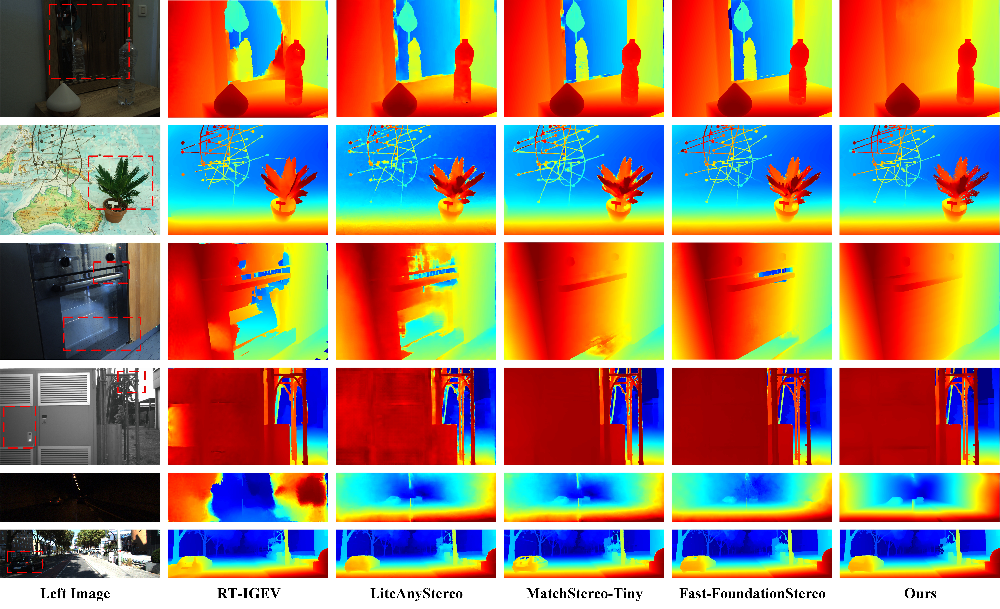

<div align="center">

<h1>WAVE-Stereo: Warp-Aligned Volume Encoding for Stereo Matching</h1>

[](https://arxiv.org/abs/2607.13674)
[](https://huggingface.co/Yama222/WAVE-Stereo/tree/main)
[](LICENSE)

</div>

## Abstract

Existing iterative stereo matching methods mainly use two correspondence representations: explicit matching search based on correlation volumes and local residual refinement based on warped features. However, these two paradigms have not yet been modeled in a unified framework. We present WAVE-Stereo, motivated by the observation that correlation volumes and feature warping provide complementary matching cues. To exploit this complementarity, we propose the GeoWarp Correspondence Encoder (GWCE), which encodes matching search, residual alignment, and disparity priors in parallel at the input of the ConvGRU. To mitigate matching degradation in weakly textured regions, we further introduce Periodic Global Context Propagation (PGCP), which periodically propagates global spatial information. Across five real-world benchmarks—Middlebury, ETH3D, KITTI 2012, KITTI 2015, and Booster—WAVE-Stereo achieves competitive zero-shot generalization without relying on priors from any external foundation model. It obtains 3.18% D1-all on KITTI 2015 and 4.42% Bad-2.0 on Booster while delivering real-time inference in 66 ms, striking a strong balance between accuracy and efficiency.

<p align="center">
  
</p>

<p align="center">
  
  
</p>

## Installation

- Clone this repository:

```bash
git clone https://github.com/yamanoko-do/WAVE-Stereo.git
cd WAVE-Stereo
```

- Create the environment:

```bash
conda create -n wavestereo python=3.12 -y
conda activate wavestereo
pip install torch==2.6.0 torchvision==0.21.0 torchaudio==2.6.0 --index-url https://download.pytorch.org/whl/cu124
pip install -r requirements.txt
```

### TensorRT Setup (Optional)

- Install the local TensorRT repository package:

```bash
wget https://developer.download.nvidia.com/compute/tensorrt/10.11.0/local_installers/nv-tensorrt-local-repo-ubuntu2204-10.11.0-cuda-12.9_1.0-1_amd64.deb

apt install -y ./nv-tensorrt-local-repo-ubuntu2204-10.11.0-cuda-12.9_1.0-1_amd64.deb
```

- Add the GPG key and install the TensorRT toolkit:

```bash
cp /var/nv-tensorrt-local-repo-ubuntu2204-10.11.0-cuda-12.9/nv-tensorrt-local-5BF87A98-keyring.gpg /usr/share/keyrings/

TRT_VER='10.11.0.33-1+cuda12.9'
apt update
apt install -y --allow-downgrades \
  libnvinfer-bin="$TRT_VER" \
  libnvinfer10="$TRT_VER" \
  libnvinfer-lean10="$TRT_VER" \
  libnvinfer-plugin10="$TRT_VER" \
  libnvinfer-vc-plugin10="$TRT_VER" \
  libnvinfer-dispatch10="$TRT_VER" \
  libnvonnxparsers10="$TRT_VER"
echo -e '\nalias trtexec="/usr/src/tensorrt/bin/trtexec"' >> ~/.bashrc
source ~/.bashrc
trtexec --version
```

- Install the TensorRT libraries:

```bash
pip install --no-cache-dir --extra-index-url https://pypi.nvidia.com/ tensorrt-cu12-libs==10.11.0.33
```

- Install the Python bindings:

```bash
pip install --extra-index-url https://pypi.nvidia.com/ tensorrt-cu12-bindings==10.11.0.33 tensorrt-cu12==10.11.0.33
```

### OpenVINO Setup (Optional)

- Download and extract the Intel NPU driver:

```bash
wget https://github.com/intel/linux-npu-driver/releases/download/v1.35.0/linux-npu-driver-v1.35.0.20260722-29947505341-ubuntu2404.tar.gz

tar xzf linux-npu-driver-v1.35.0.20260722-29947505341-ubuntu2404.tar.gz
```

- Install the NPU driver components:

```bash
sudo apt install -y \
  ./intel-fw-npu_*.deb \
  ./intel-level-zero-npu_*.deb \
  ./intel-driver-compiler-npu_*.deb
```

- Install the OpenVINO Python packages:

```bash
python -m pip install --force-reinstall --no-cache-dir openvino openvino-genai
```

- Install the Intel GPU runtime dependencies:

```bash
sudo apt install libze-intel-gpu1 intel-opencl-icd intel-ocloc
```

- Verify that the Intel GPU and NPU are available. The output should look similar to `['CPU', 'GPU.0', 'GPU.1', 'NPU']`:

```bash
python -c "import openvino as ov; print(ov.Core().available_devices)"
```

## Quick Start

### PyTorch Inference

Run inference on a rectified stereo pair:

```bash
python tools/infer.py \
  --backend pytorch \
  --config cfgs/wavestereo.yaml \
  --weights /path/to/checkpoint.pth \
  --left assets/explorer_20-41-07_left.png \
  --right assets/explorer_20-41-07_right.png \
  --output outputs/pytorch_demo
```

Run live camera inference:

```bash
python tools/infercam.py \
  --backend pytorch \
  --config cfgs/wavestereo.yaml \
  --weights /path/to/checkpoint.pth \
  --cam-file cfgs/camera/zed_calib/hd720 \
  --zfar 9
```

### Accelerated Inference

#### Export to ONNX

Each export is fully defined by a target configuration. The three default profiles provided by the repository use the same model semantics and fixed `180x360` input; they differ only in their verified graph implementations.

| Export config | Profile | In-graph preprocessing | Allowed OpenVINO device |
| --- | --- | --- | --- |
| `cfgs/export/standard.yaml` | `standard` | reference arithmetic | any supported device |
| `cfgs/export/intel_gpu.yaml` | `intel_gpu` | per-channel lookup | Intel GPU |
| `cfgs/export/intel_npu.yaml` | `intel_npu` | affine multiply/add | Intel NPU |

```bash
python tools/export_onnx.py \
  --export-config cfgs/export/standard.yaml \
  --weights /path/to/checkpoint.pth

python tools/export_onnx.py \
  --export-config cfgs/export/intel_gpu.yaml \
  --weights /path/to/checkpoint.pth

python tools/export_onnx.py \
  --export-config cfgs/export/intel_npu.yaml \
  --weights /path/to/checkpoint.pth
```

#### TensorRT

- Build a TensorRT inference engine:

```bash
MODEL_DIR=outputs/onnx/standard/180x360_iter4_maxdisp192

trtexec \
  --onnx="$MODEL_DIR/model.onnx" \
  --saveEngine="$MODEL_DIR/model.engine" \
  --fp16
```

- Run a stereo pair with the TensorRT engine:

```bash
python tools/infer.py \
  --backend tensorrt \
  --model-dir outputs/onnx/standard/180x360_iter4_maxdisp192 \
  --left ./assets/explorer_20-41-07_left.png \
  --right ./assets/explorer_20-41-07_right.png \
  --output ./outputs/tensorrt_demo
```

- Run live camera inference with the same TensorRT engine:

```bash
python tools/infercam.py \
  --backend tensorrt \
  --model-dir outputs/onnx/standard/180x360_iter4_maxdisp192 \
  --cam-file ./cfgs/camera/zed_calib/hd720
```

#### OpenVINO

After exporting the ONNX graph for the target compute device, you can use OpenVINO for accelerated inference on a CPU, Intel GPU, or Intel NPU.

Run a rectified stereo pair on the CPU:

```bash
python tools/infer.py \
  --backend openvino \
  --model-dir outputs/onnx/standard/180x360_iter4_maxdisp192 \
  --openvino-device CPU \
  --left assets/explorer_20-41-07_left.png \
  --right assets/explorer_20-41-07_right.png \
  --output outputs/openvino_demo
```

Run live camera inference on the NPU (tested only on an Intel Core Ultra 5 125H, Meteor Lake):

```bash
python tools/infercam.py \
  --backend openvino \
  --model-dir outputs/onnx/intel_npu/180x360_iter4_maxdisp192 \
  --openvino-device NPU \
  --cam-file cfgs/camera/zed_calib/hd720 \
  --camera-preprocess auto \
  --disparity-upsample adaptive \
  --disparity-upsample-sigma 2.0 \
  --zfar 9
```

## Citation

```bibtex
@article{wavestereo2026,
  title={WAVE-Stereo: Warp-Aligned Volume Encoding for Stereo Matching},
  author={Zehan Liu and Yage He},
  journal={arXiv preprint arXiv:2607.13674},
  year={2026}
}
```

## License

This project is released under the Apache License 2.0.

## Acknowledgements

This project builds on [IGEV++](https://github.com/gangweiX/IGEV-plusplus),
[LightStereo](https://github.com/XiandaGuo/OpenStereo),
[WAFT-Stereo](https://github.com/princeton-vl/WAFT-Stereo), and
[Fast-FoundationStereo](https://github.com/NVlabs/Fast-FoundationStereo).
